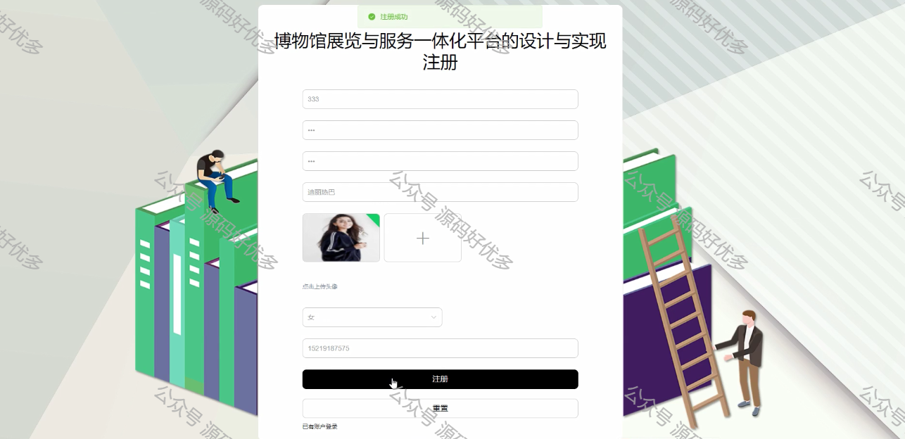
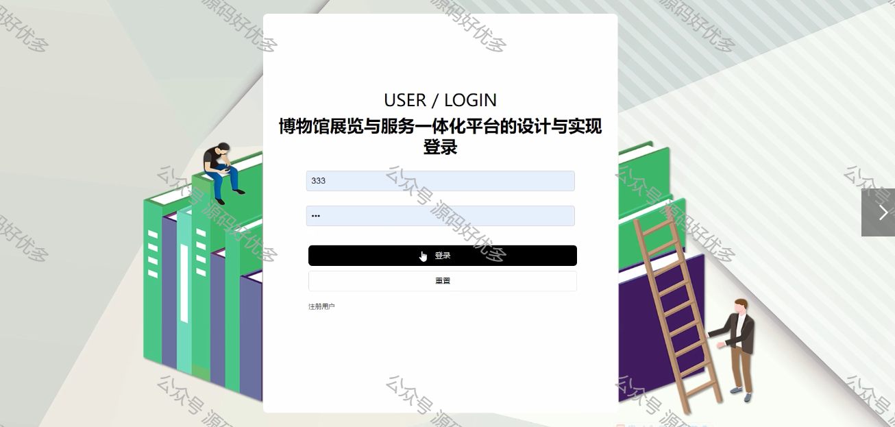
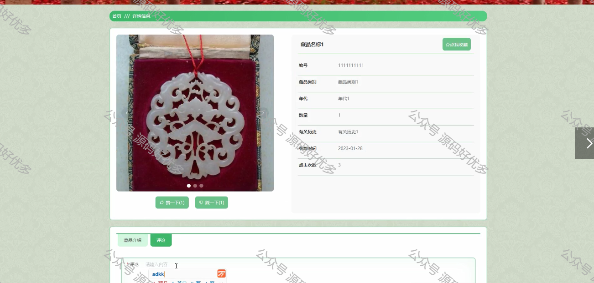
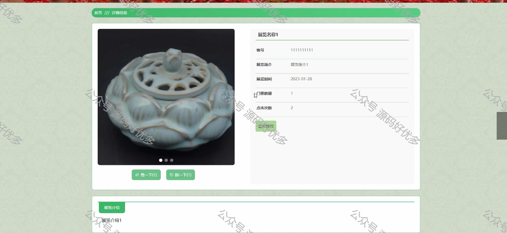
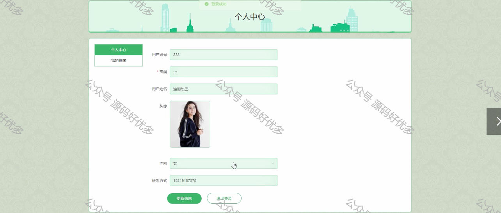
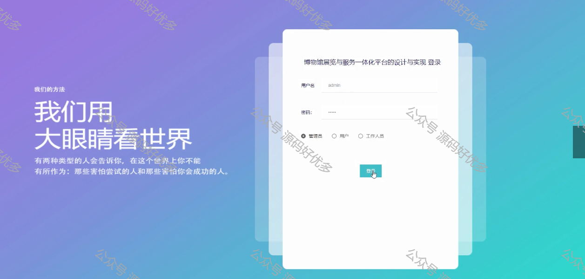
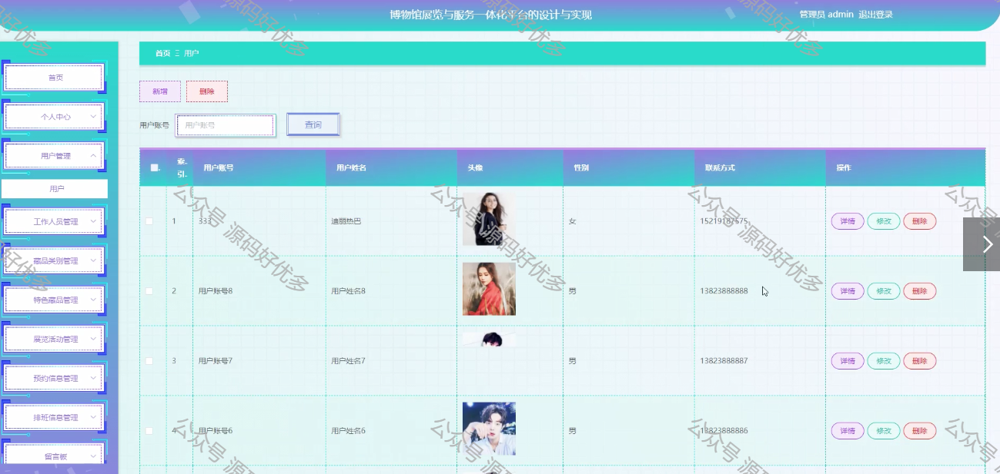
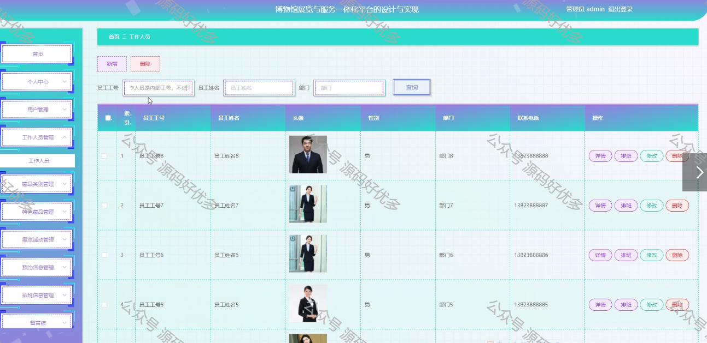

 
## 查看主页获取源码

> **作者介绍**： **✌**全网粉丝10W+本平台特邀作者、博客专家、CSDN新星计划导师、java领域优质创作者,博客之星、掘金/华为云/阿里云/InfoQ等平台优质作者、专注于毕业项目实战 **✌**

  

### 一、作品包含

源码+数据库+设计文档万字LW+PPT+全套环境和工具资源+部署教程

### 二、项目技术

前端技术：Html、Css、Js、Vue、Element-ui

数据库：MySQL

后端技术：Java、Spring Boot、MyBatis

  

### 三、运行环境

开发工具：IDEA/eclipse

数据库：MySQL5.7

数据库管理工具：Navicat10以上版本

环境配置软件： JDK1.8+Maven3.6.3

前端Nodejs：14

  

### 四、项目介绍
项目编号：springbootA066

博物馆展览与服务一体化，其工作流程繁杂、多样、管理复杂与设备维护繁琐。而计算机已完全能够胜任博物馆展览与服务一体化工作，而且更加准确、方便、快捷、高效、清晰、透明，它完全可以克服以上所述的不足之处。这将给查询信息和管理带来很大的方便，从而给博物馆展览与服务一体化管理者带来更高的效率，这也是博物馆展览与服务一体化正规化、现代化的重要标志。
博物馆展览与服务一体化平台主要是用java语言开发的。系统根据B/S架构设计，选用springboot框架开发。Eclipse开发工具，形成的数据储存在MySQL数据库中。系统分成管理员控制模块和用户、工作人员模块。管理员可以管理用户信息、工作人员信息、特色藏品、展览活动、预约信息、排班信息等。工作人员对排班信息进行管理操作，用户可以查询特色藏品、展览活动、预约信息等和设定本人系统。本系统有良好的界面体验，功能基本齐全，让使用者体验度大大提升。

### 五、运行截图

